# Retail Sales & Inventory Analytics on Microsoft Fabric

An end-to-end analytics engineering portfolio project built with Microsoft Fabric, OneLake, Data Factory pipelines, PySpark, Delta Lake, and the SQL analytics endpoint.

## Project status

### Completed

- source-data profiling and reproducible monthly sales batches
- OneLake landing-zone structure
- parameter-driven monthly sales ingestion
- historical and incremental Copy Activity runs
- Bronze Delta tables for sales and reference data
- PySpark Bronze-to-Silver transformations
- transformation-level data-quality checks
- Silver sales deduplication and Delta merge
- SQL reconciliation of Bronze and Silver tables

### In progress

- Gold dimensional model
- cross-layer data-quality notebook
- pipeline orchestration and failure paths
- Direct Lake semantic model
- DAX measures
- Power BI Web report
- final architecture and evidence documentation

Only implemented and verified functionality is described as completed.

## Business scenario

A fictional multi-store toy retailer needs to integrate transaction, product, store, calendar, and current inventory data to monitor commercial performance and identify store-product combinations that may require inventory review.

The project is designed to answer:

- How do revenue, units sold, and estimated gross profit change over time?
- Which products, categories, and stores perform best?
- How much inventory is currently recorded at each store?
- Which store-product combinations have low stock relative to recent sales velocity?
- Which products have high inventory but limited recent demand?
- Which items should be prioritised for replenishment review?

## Source data

The project uses the [Mexico Toy Sales dataset from Maven Analytics](https://mavenanalytics.io/data-playground/mexico-toy-sales), published as Public Domain.

The source contains:

| Source | Grain | Rows |
|---|---|---:|
| Sales | One transaction per `Sale_ID` | 829,262 |
| Products | One row per `Product_ID` | 35 |
| Stores | One row per `Store_ID` | 50 |
| Inventory | One row per available store-product position | 1,593 |
| Calendar | One row per date | 638 |

Sales cover 1 January 2022 through 30 September 2023.

Source files are excluded from Git because they can be downloaded from the original public source. The repository includes a reproducible Pandas profiling script and machine-readable profiling results.

See:

- `scripts/profile_source.py`
- `scripts/create_sales_batches.py`
- `reports/source_profile.json`
- `data/README.md`

## Architecture

```text
Maven Analytics CSV files
          │
          ▼
Local source profiling and monthly batch generation
          │
          ▼
OneLake landing zone
Files/landing/maven_toys/
          │
          ▼
Fabric Data Factory pipelines and Copy Activities
          │
          ▼
Bronze Delta tables
          │
          ▼
nb_bronze_to_silver
PySpark cleaning, validation, deduplication, and Delta merge
          │
          ▼
Silver conformed Delta tables
          │
          ▼
Gold dimensional model                         [In progress]
          │
          ▼
SQL analytics endpoint
          │
          ▼
Direct Lake semantic model and Power BI Web    [Planned]
```

The final architecture diagram will be stored under:

```text
docs/architecture/
```

## Fabric components

| Component | Name | Purpose |
|---|---|---|
| Workspace | `Retail Analytics` | Project workspace |
| Lakehouse | `lh_retail_analytics` | OneLake files and Delta tables |
| Sales pipeline | `pl_retail_bronze_load` | Parameter-driven monthly sales ingestion |
| Reference pipeline | `pl_retail_reference_load` | Products, stores, inventory, and calendar ingestion |
| Notebook | `nb_bronze_to_silver` | PySpark cleaning and conformance |
| SQL analytics endpoint | Lakehouse endpoint | SQL validation and reconciliation |

## OneLake landing design

```text
Files/
└── landing/
    └── maven_toys/
        ├── reference/
        │   ├── products.csv
        │   ├── stores.csv
        │   ├── inventory.csv
        │   ├── calendar.csv
        │   └── data_dictionary.csv
        └── sales/
            ├── sales_2022_01.csv
            ├── ...
            └── sales_2023_09.csv
```

The `landing` directory represents files that have arrived in OneLake but have not yet been transformed into managed Delta tables.

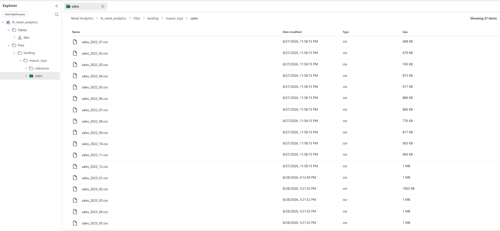

## Incremental ingestion

The original sales file is reproducibly divided into 21 monthly batches by:

```text
scripts/create_sales_batches.py
```

The sales Pipeline accepts a runtime parameter:

```text
sales_file_pattern
```

A monthly run supplies an exact filename such as:

```text
sales_2023_02.csv
```

This allows the same Pipeline definition to process different monthly batches without editing the activity configuration.

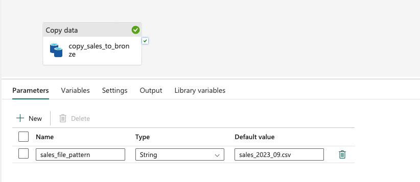

The Copy Activity uses the parameter as its source filename.


The initial historical load processed the twelve monthly files from 2022.

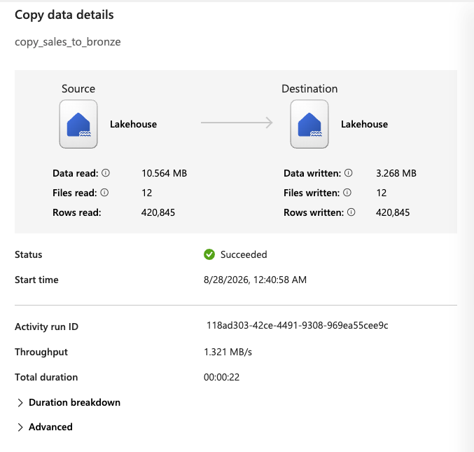

Subsequent runs processed monthly 2023 files individually, creating separate monitoring records for each execution.

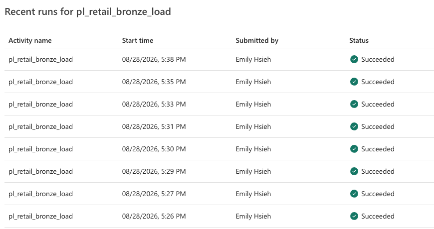

### Current limitation

The MVP uses explicit monthly file selection. Copy Activity appends records to Bronze and does not maintain a processed-file control table.

A production implementation would add ingestion-control metadata to prevent an already processed file from being appended unintentionally.

Silver processing is designed to be idempotent by deduplicating on `sale_id` and merging into the Delta target. Controlled replay testing remains a future enhancement.

## Bronze layer

The Bronze layer stores source-aligned records plus technical ingestion metadata:

```text
bronze_sales
bronze_products
bronze_stores
bronze_inventory
bronze_calendar
```

Technical fields include:

```text
_ingested_at
_source_file
```

Reference extracts use overwrite semantics, while monthly sales files use append semantics.

The reference-data Pipeline loads the product, store, inventory, and calendar extracts into separate Bronze Delta tables.

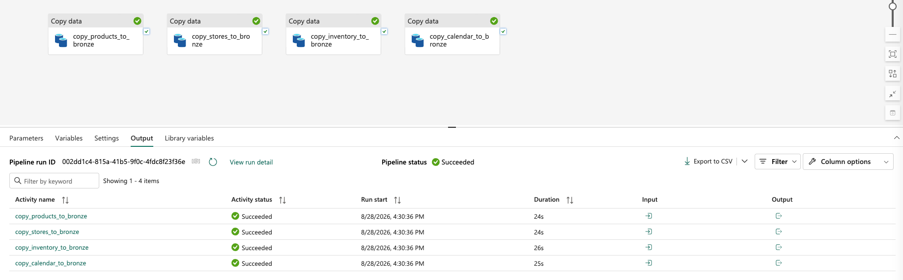

SQL endpoint checks confirm the expected Bronze reference-table row counts.

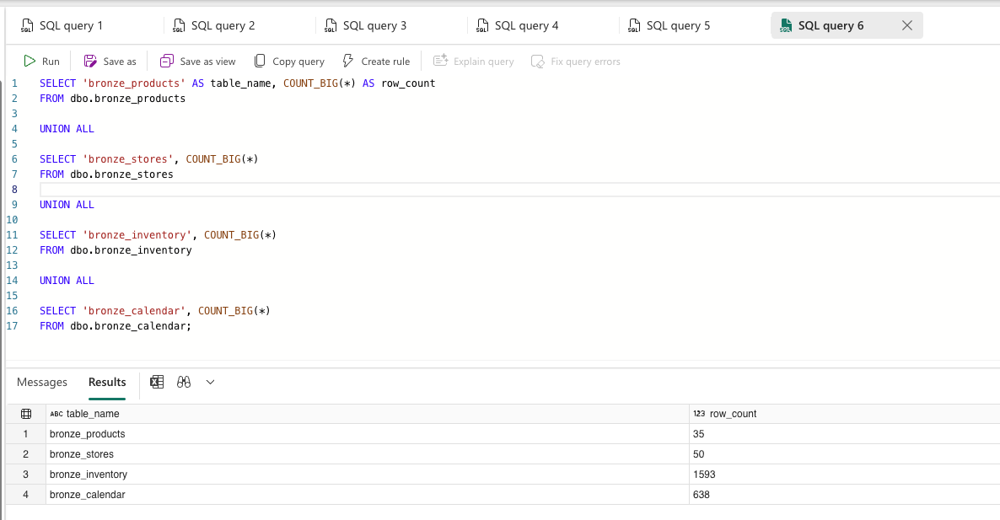

Bronze SQL reconciliation verifies:

- persisted row count
- sale ID uniqueness
- sales date boundaries
- total units
- number of source files
- ingestion metadata completeness

The completed Bronze dataset contains 829,262 unique sales across 21 monthly source files, covering January 2022 through September 2023.

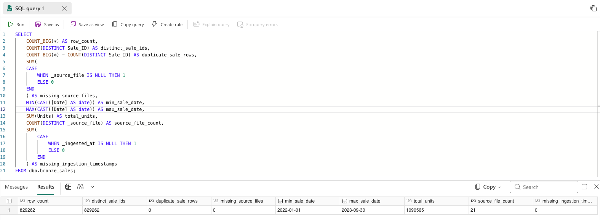

## Silver layer

The Fabric Notebook `nb_bronze_to_silver` produces:

```text
silver_products
silver_stores
silver_inventory_position
silver_calendar
silver_sales
```

The executable notebook is stored at:

```text
notebooks/nb_bronze_to_silver.ipynb
```

Notebook outputs are retained as evidence that the PySpark transformations were executed in Microsoft Fabric.

### Product transformations

Product processing:

- trims descriptive attributes
- converts currency-formatted cost and price to decimal values
- verifies non-null and unique product keys
- validates that parsed cost and price values are present
- reports products priced below cost as a business warning rather than an automatic failure

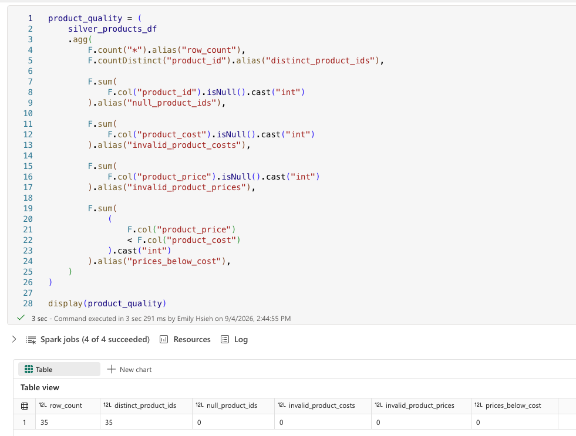

### Store transformations

Store processing:

- standardises column names
- parses store opening dates
- verifies non-null and unique store keys
- blocks blank store names and invalid dates

### Inventory-position transformations

Inventory processing:

- maintains one row per available store-product position
- converts stock on hand to integer
- validates composite-key uniqueness
- blocks null, invalid, negative, and orphan key values
- distinguishes explicit zero stock from absent inventory combinations

The source contains:

```text
77 explicit zero-stock positions
157 absent store-product combinations
```

Absent combinations are not converted to zero because the source does not distinguish missing data from products that are not ranged at a store. The coverage check reports this source limitation rather than treating the 157 absent combinations as failed records.

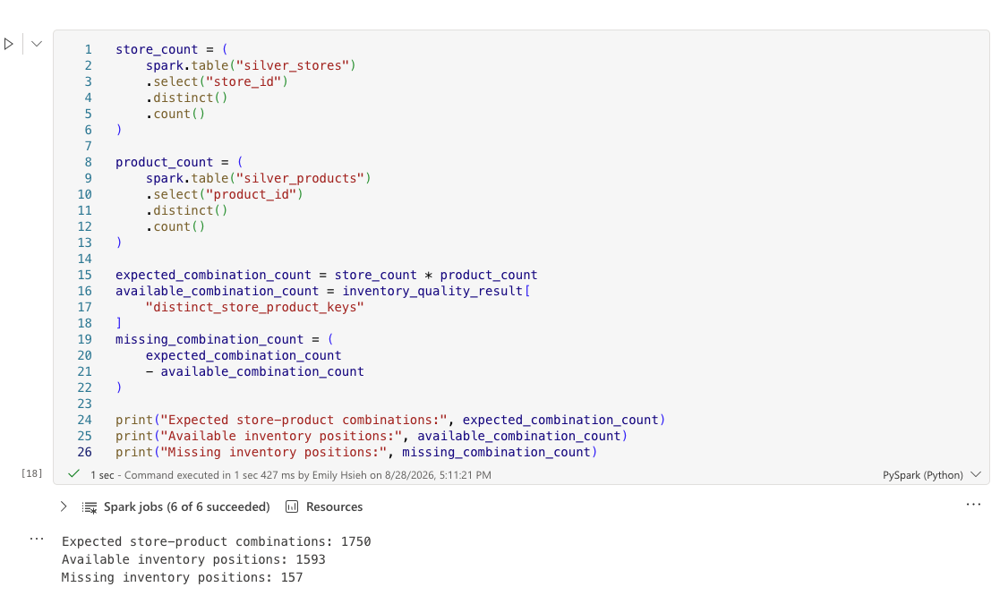

### Sales transformations

Sales processing:

- standardises transaction fields and types
- parses transaction dates
- validates positive unit quantities
- checks store and product relationships
- deduplicates by `sale_id`
- retains the latest ingestion record
- merges into the Silver Delta target

Transformation-level checks validate sale keys, required dates, store and product keys, and positive unit quantities.

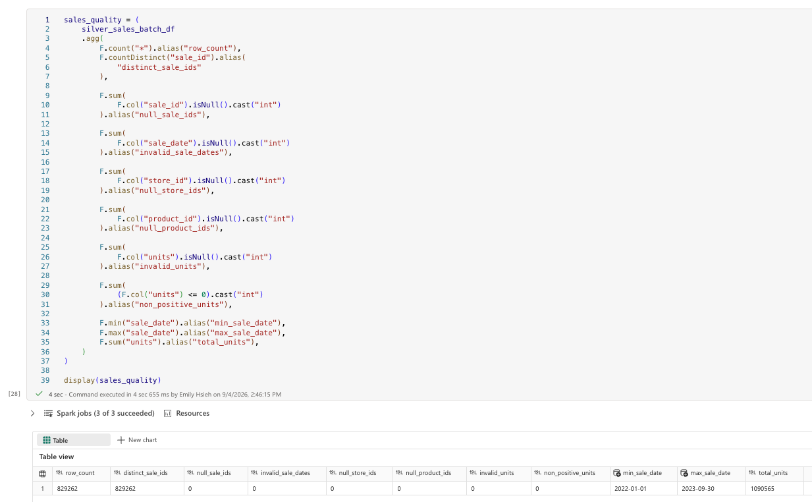

Referential-integrity checks confirm that sales contain no unmatched store or product keys.

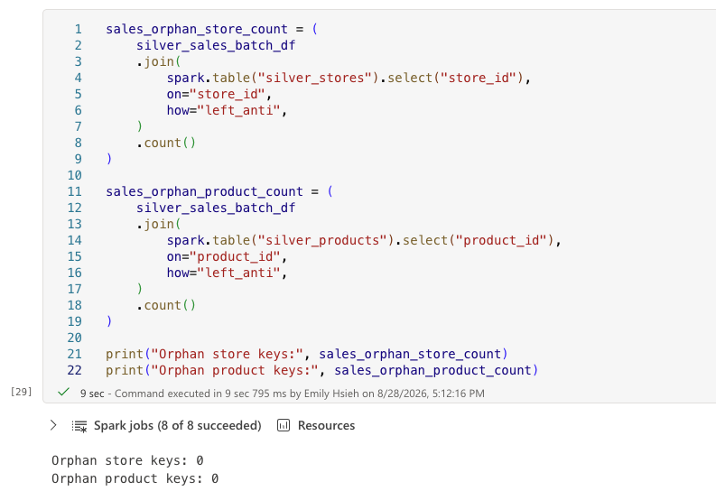

The Notebook reads the persisted `silver_sales` Delta table after the merge and confirms the saved row count, distinct sale IDs, date boundaries, and total units.

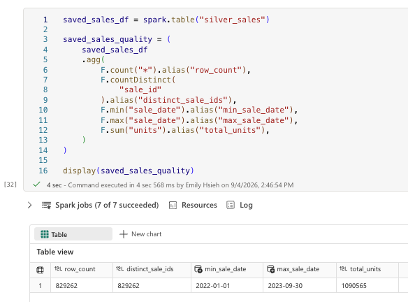

Final reconciliation through the SQL analytics endpoint confirms row-count uniqueness, date boundaries, total units, and zero orphan store and product keys.

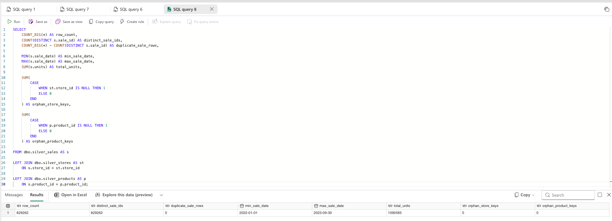

The current Bronze source contains no duplicate sale IDs. The deduplication and merge logic has been implemented, but duplicate-input recovery has not yet been validated through a controlled batch replay.

## Inventory limitation

The source represents current stock on hand and does not include:

- historical inventory snapshot dates
- replenishment events
- stock movements
- purchase orders
- supplier lead times
- recorded lost sales

The model therefore uses:

```text
silver_inventory_position
```

rather than claiming to contain historical inventory snapshots.

An ingestion timestamp is retained for audit purposes, but it is not presented as the business date when inventory was measured.

The project will not claim to calculate:

- historical stockout events
- sales lost because of stockouts
- historical inventory movement
- exact replenishment quantities
- causal demand forecasts

Inventory outputs will be presented as current-position indicators and replenishment-review candidates.

## Planned Gold model

The proposed Gold model is:

```text
fact_sales
fact_inventory_position
dim_product
dim_store
dim_date
```

This model will be confirmed during Gold implementation. A historical `fact_inventory_snapshot` will not be created because the source does not contain snapshot dates.

## Data-quality strategy

Blocking checks stop transformations for:

- empty required sources
- null or duplicate business keys
- unparseable dates or numeric values
- negative inventory quantities
- non-positive sales quantities
- orphan product or store references

Business warnings remain queryable but do not automatically fail the pipeline. Examples include:

- products priced below cost
- explicit zero-stock positions
- missing inventory combinations

This distinction prevents valid business conditions from being misclassified as corrupted data.

## Repository structure

```text
.
├── README.md
├── data/
│   └── README.md
├── notebooks/
│   └── nb_bronze_to_silver.ipynb
├── reports/
│   └── source_profile.json
├── scripts/
│   ├── create_sales_batches.py
│   └── profile_source.py
├── docs/
│   ├── architecture/
│   └── screenshots/
├── requirements.txt
└── .gitignore
```

## Reproducibility

Create and activate the local Python environment:

```bash
python3 -m venv .venv
source .venv/bin/activate
pip install -r requirements.txt
```

Place the downloaded source files under:

```text
data/raw/maven_toys/
```

Run source profiling:

```bash
python scripts/profile_source.py
```

Generate monthly sales batches:

```bash
python scripts/create_sales_batches.py
```

Fabric Pipelines and Notebooks must be recreated or imported in a Microsoft Fabric-enabled workspace.

## Project positioning

This is a portfolio implementation built in a Microsoft Fabric Trial environment. It demonstrates hands-on use of Fabric engineering and analytics features but is not presented as production employment experience.

Production improvements would include:

- processed-file control metadata
- automated artifact deployment
- environment-specific configuration
- secrets management
- alerting and notification integration
- operational service-level objectives
- historical inventory snapshots from a suitable operational source
