# Retail Sales & Inventory Analytics with Microsoft Fabric


## Overview <!-- omit from toc -->

This project implements an end-to-end retail analytics solution using monthly sales files and a current inventory position.

It combines reproducible source profiling, parameterised Microsoft Fabric ingestion, validated PySpark transformations, a two-fact Gold star schema, and a Direct Lake semantic model with reusable DAX measures.

The four-page Power BI report helps a regional manager monitor performance, investigate weekday, product, and store drivers, and prioritise inventory or store-level follow-up.

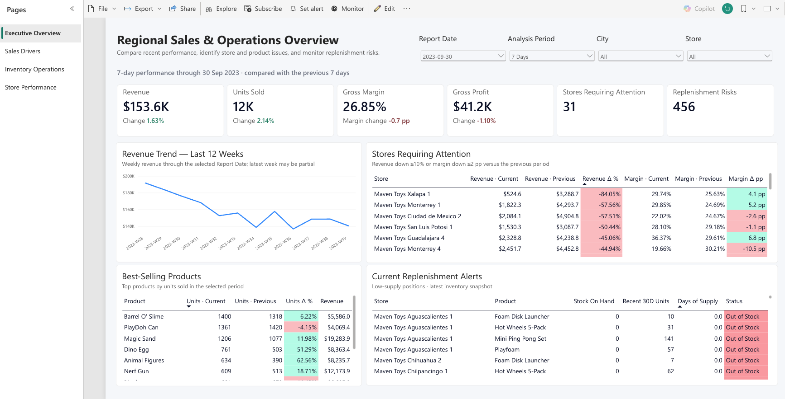

## Contents <!-- omit from toc -->

- [Power BI Report](#power-bi-report)
- [Architecture](#architecture)
- [Data Foundation](#data-foundation)
- [Data Engineering Implementation](#data-engineering-implementation)
- [Data Quality and Validation](#data-quality-and-validation)
- [Semantic Model and Business Logic](#semantic-model-and-business-logic)
- [Project Structure](#project-structure)
- [Reproduce the Solution](#reproduce-the-solution)
- [Production Considerations](#production-considerations)

## Power BI Report

The four report pages turn this analytical foundation into a connected management workflow: monitor overall performance, investigate its weekday, category, and product drivers, review current inventory risks, and compare stores requiring follow-up.

### 1. Regional Sales & Operations Overview

The overview page helps regional managers monitor recent performance, place short-term movement in a longer trend, and identify stores requiring follow-up, leading products, and current replenishment risks. Sales metrics follow the selected report date and analysis period, while replenishment alerts use the latest inventory position.

Key questions:

- Is revenue, unit volume, margin, or gross profit deteriorating?
- Which stores should be prioritised for follow-up?
- Which store-product positions may require replenishment review?
- Which products are selling most strongly?

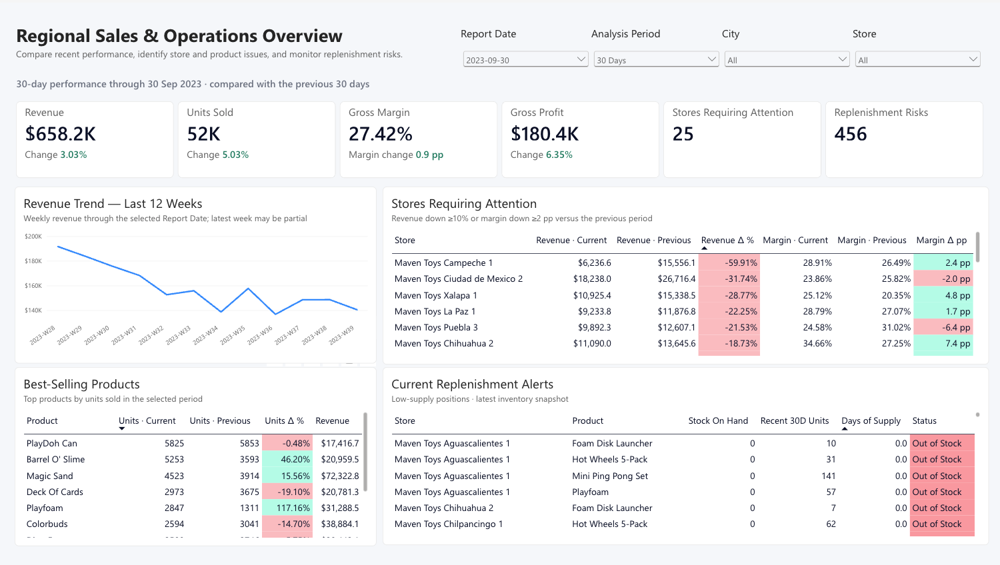

### 2. Sales Performance Drivers

This page explains period-over-period change by weekday, category, and product. Because retail demand varies by day of week, managers can compare like-for-like weekdays and select a day to inspect its underlying date-level trend. City, store, category, and product detail help locate where the change occurred.

Key questions:

- Which weekdays are performing differently from the previous period?
- Which categories, products, or stores are driving revenue and unit changes?
- Which products combine strong sales with weak margin?

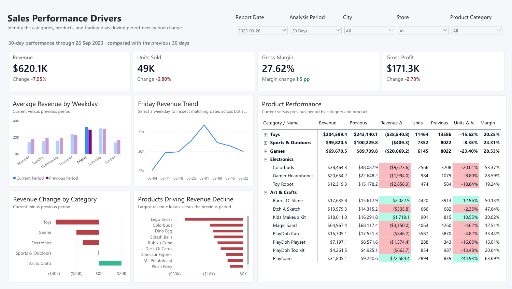

### 3. Inventory Operations

This page combines the latest inventory position with recent 30-day sales velocity to support replenishment and overstock review. Regional managers can identify immediate stock risks, locate slow-moving inventory, and see where inventory investment is concentrated across stores and product categories.

Key questions:

- Which store-product positions may require replenishment before stock constrains sales?
- Which positions have no recent demand or more than sixty days of supply?
- Where is inventory cost concentrated across stores and categories?

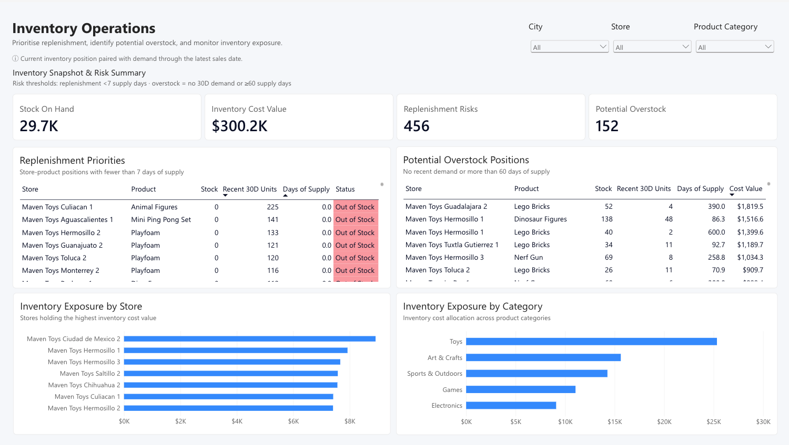

### 4. Store Performance

This page helps regional managers compare store growth and profitability, identify performance outliers, and prioritise follow-up. Selecting a store from the chart, matrix, or filter reveals its twelve-week revenue trend for closer investigation.

Key questions:

- Which stores are growing or deteriorating across revenue and margin?
- Is a store’s recent performance part of a sustained trend or a short-term movement?
- Which cities and stores should be prioritised for management intervention?

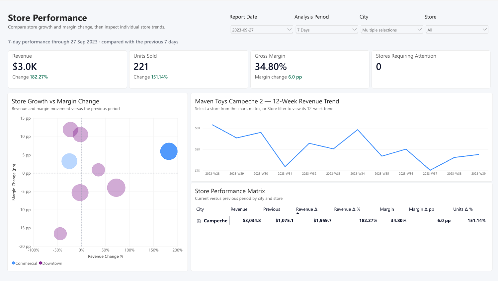


## Architecture

The solution separates reproducible local preparation from the analytical pipeline implemented in Microsoft Fabric.

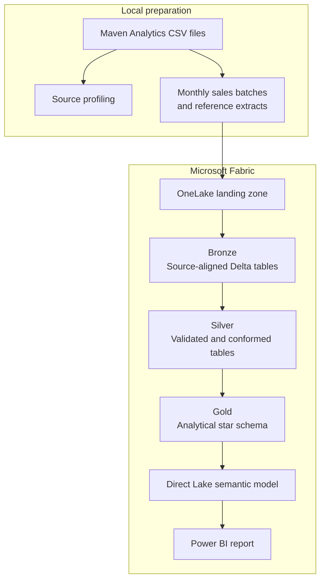

The diagram shows the primary source-to-report path. See the [technical architecture](docs/architecture.md) for the complete item-level flow, Fabric asset relationships, and architectural design choices.

## Data Foundation

The project uses the [Mexico Toy Sales dataset from Maven Analytics](https://mavenanalytics.io/data-playground/mexico-toy-sales), published as Public Domain.

| Source | Grain | Rows |
|---|---|---:|
| Sales | One transaction per `Sale_ID` | 829,262 |
| Products | One row per `Product_ID` | 35 |
| Stores | One row per `Store_ID` | 50 |
| Inventory | One supplied store-product position | 1,593 |
| Calendar | One row per date | 638 |
| Data dictionary | One table-field definition | 19 |

Sales cover 1 January 2022 through 30 September 2023 and contain 1,090,565 units.

Two local scripts prepare a reproducible ingestion baseline:

| Script | Purpose | Output |
|---|---|---|
| `profile_source.py` | Profiles structure, keys, missing values, date coverage, and cross-file relationships | `reports/source_profile.json` |
| `create_sales_batches.py` | Partitions the original sales file by calendar month | 21 monthly sales files |

> [!IMPORTANT]
> Inventory represents the latest supplied store-product position rather than a historical snapshot. The project therefore does not claim to reconstruct historical inventory levels.

See the [source-data documentation](data/README.md) for detailed profiling results, source constraints, and confirmed data grains.

## Data Engineering Implementation

The Fabric implementation follows a Medallion design in which each layer has a distinct responsibility:

- **Ingestion and Bronze:** Parameterised Data Factory pipelines append monthly sales batches and overwrite complete reference extracts. Bronze preserves source-aligned fields with ingestion timestamps and source-file metadata.
- **Silver:** `nb_bronze_to_silver` standardises data types and names, validates keys and relationships, and applies sale-level deduplication through an idempotent Delta merge.
- **Gold:** `nb_silver_to_gold` rebuilds a two-fact analytical model from validated Silver data and reconciles the persisted results.
- **Orchestration:** `pl_retail_transform` runs the Silver notebook first and starts the Gold notebook only after successful completion.

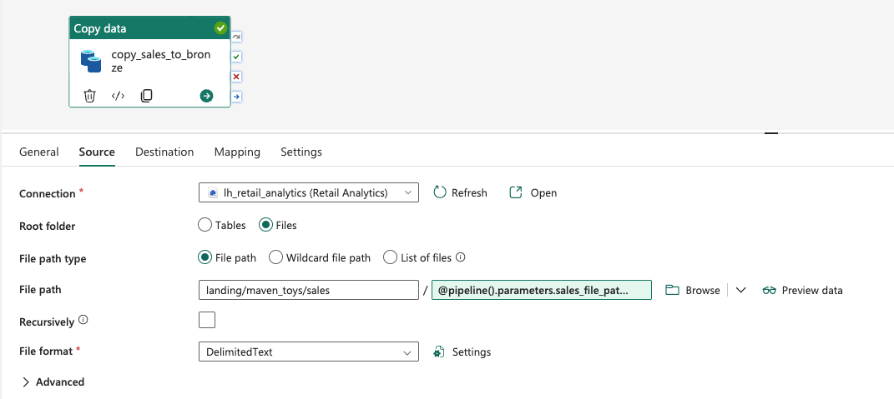

*The parameterised source allows the same Copy Activity to process different monthly sales files.*

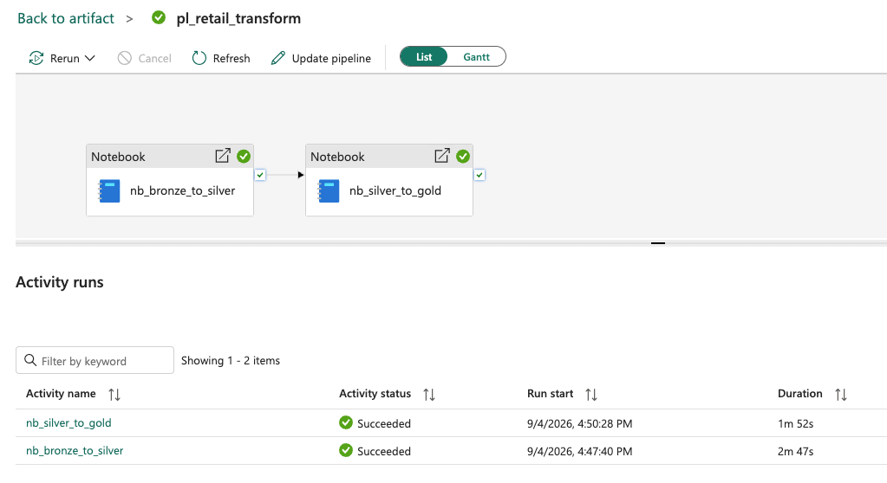

*The Gold notebook runs only after the Silver notebook completes successfully.*

### Gold Analytical Model

| Table | Type | Grain |
|---|---|---|
| `fact_sales` | Fact | One sales transaction |
| `fact_inventory_position` | Fact | One supplied store-product position |
| `dim_product` | Dimension | One product |
| `dim_store` | Dimension | One store |
| `dim_date` | Dimension | One calendar date |

`dim_product` and `dim_store` are conformed dimensions shared by both fact tables. `dim_date` relates only to `fact_sales` because the inventory source does not include a snapshot date.

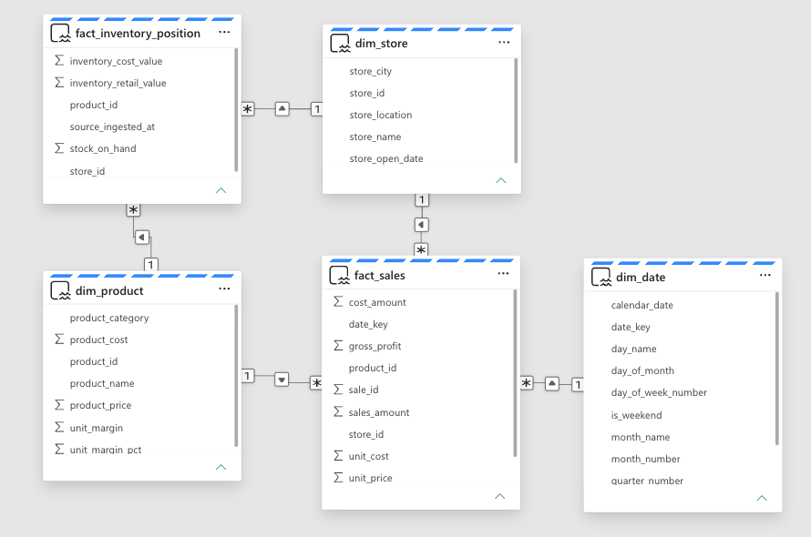

*The Gold tables form a two-fact star schema for sales and current inventory analysis.*

## Data Quality and Validation

Validation is applied before and after transformation writes. Blocking failures prevent invalid data from reaching the next layer, while valid operational exceptions remain available for analysis.

| Validation area | Key checks | Outcome |
|---|---|---|
| Source profiling | File structure, required columns, key coverage, date ranges, and cross-file relationships | Establishes a reproducible source baseline |
| Silver pre-write validation | Empty sources, null or duplicate keys, parsing failures, invalid quantities, and orphan references | Prevents invalid conformed tables from being written |
| Gold post-write reconciliation | Row counts, table grain, key uniqueness, date boundaries, units, monetary totals, and foreign-key coverage | Confirms that persisted analytical tables match expected results |
| Business-condition review | Explicit zero stock, products priced below cost, and absent inventory combinations | Retains valid operational exceptions without treating them as corrupted data |

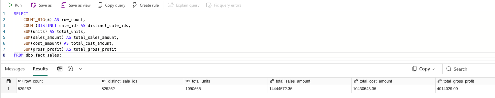

*SQL endpoint reconciliation confirms the persisted sales row count, distinct transaction count, total units, and monetary totals.*

## Semantic Model and Business Logic

### Direct Lake Model, Controls, and Measures

The Direct Lake semantic model exposes the Gold Delta tables without importing another data copy and adds reusable DAX measures, report controls, and operational indicators used across the four report pages.

One-to-many, single-direction relationships allow:

- `dim_product` to filter both fact tables
- `dim_store` to filter both fact tables
- `dim_date` to filter `fact_sales`

The report was designed to support analysis from a selectable historical date rather than only the latest available date. Two disconnected selector tables provide this flexibility without directly filtering the underlying facts:

| Selector table | Purpose |
|---|---|
| `Report Date` | Defines the date on which sales performance is evaluated |
| `Analysis Period` | Controls the length and comparison basis of the current and previous periods |

DAX measures read the selected values and construct the required date windows. This prevents the report-date slicer from restricting sales to one physical date when a seven-day or thirty-day calculation is required.

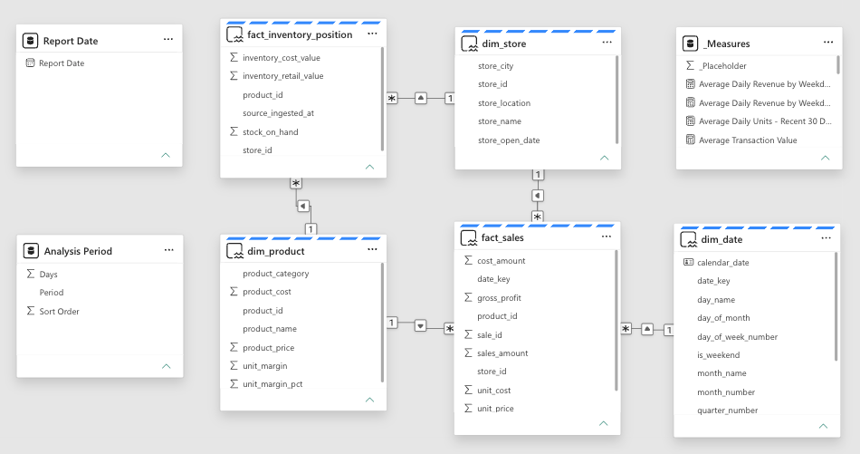

*The Direct Lake model combines the Gold star schema with disconnected report controls and a dedicated measure table.*

Reusable calculations are organised in a dedicated `_Measures` table:

| Display folder | Responsibility |
|---|---|
| `00 Controls` | Latest sales date, selected report date, and selected period length |
| `01 Base` | Reusable revenue, units, gross-profit, and gross-margin aggregations |
| `02 Period` | Current, previous, and change measures organised by Revenue, Units, Profit, and Margin |
| `03 Inventory` | Current stock, recent demand, days of supply, and inventory status |
| `04 Attention` | Store-attention flags, replenishment-risk counts, and exception indicators |
| `05 Display Text` | Dynamic titles and subtitles reflecting current report selections |

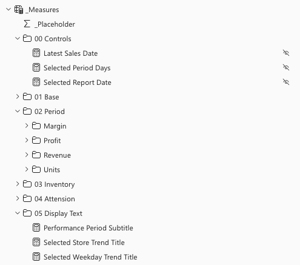

*Measures are grouped by analytical responsibility rather than stored as one unstructured list.*

### Time-Comparison Rules

The report uses the disconnected selectors and period measures according to the following rules:

| Rule | Definition | Purpose |
|---|---|---|
| Default view | Uses the latest sales date and a 7-day analysis period | Provides a useful initial report state |
| Daily comparison | Compares the selected date with the same weekday 7 days earlier | Avoids comparing different trading days |
| 7-day comparison | Compares the 7 days ending on the report date with the preceding 7 days | Monitors short-term performance |
| 30-day comparison | Compares the 30 days ending on the report date with the preceding 30 days | Provides a more stable view of recent performance |
| 12-week trend | Shows weekly revenue through the selected report date; the latest week may be partial | Places the selected period in a longer-term context |

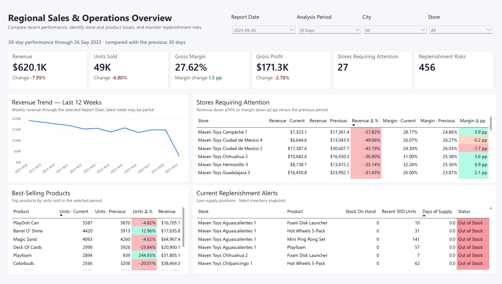

*The selected report date and analysis period recalculate current and previous-period performance.*

### Operational Indicator Definitions

Inventory indicators combine the latest supplied stock position with demand through the latest sales date. They therefore remain independent of the historical `Report Date` selector.

| Indicator | Definition | Purpose |
|---|---|---|
| Replenishment risk | Positive recent demand with fewer than 7 days of supply | Identifies store-product positions requiring replenishment review |
| Potential overstock | No units sold in the last 30 days, or at least 60 days of supply | Identifies potentially slow-moving inventory |
| Store attention | Revenue down by at least 10%, or margin down by at least 2 percentage points | Prioritises stores for management investigation |

A missing store-product combination is not interpreted as zero stock and is excluded from inventory-risk classification.

## Project Structure

```text
.
├── README.md
├── data/
│   └── README.md
├── docs/
│   ├── architecture.md
│   ├── deployment.md
│   └── screenshots/
│       ├── lakehouse/
│       ├── notebooks/
│       ├── pipelines/
│       ├── report/
│       └── semantic-model/
├── fabric/
│   ├── notebooks/
│   ├── pipelines/
│   ├── report/
│   └── semantic-model/
├── reports/
│   └── source_profile.json
├── scripts/
│   ├── create_sales_batches.py
│   ├── prepare_fabric_deployment.py
│   └── profile_source.py
├── sql/
│   └── validate_gold.sql
├── requirements.txt
└── .gitignore
```

## Reproduce the Solution

Rebuild the project in two stages: prepare the source files locally, then deploy the Fabric items in dependency order.

### 1. Prepare the Source Files Locally

Create a Python environment and install the required dependencies:

```bash
python3 -m venv .venv
source .venv/bin/activate
pip install -r requirements.txt
```

Download the six CSV files from the [Maven Analytics Mexico Toy Sales dataset](https://mavenanalytics.io/data-playground/mexico-toy-sales) and place them in:

```text
data/raw/maven_toys/
```

Generate the reproducible source profile and monthly sales batches:

```bash
python scripts/profile_source.py
python scripts/create_sales_batches.py
```

After preparation, the upload inputs consist of:

- 21 monthly sales files under `data/raw/maven_toys/load_batches/`
- five unchanged reference files from the source package

The source profile is written to `reports/source_profile.json`.

### 2. Deploy the Fabric Solution

Use the prepared files and exported Fabric definitions to recreate the Lakehouse, ingestion pipelines, transformation notebooks, Direct Lake semantic model, and Power BI report.

Follow the [Fabric deployment guide](docs/deployment.md) for the required deployment order, target-specific binding preparation, and validation steps.

## Production Considerations

This portfolio project was built in a Microsoft Fabric Trial environment. A production implementation would additionally require:

- a processed-file ledger or ingestion watermark to prevent unnecessary Bronze reprocessing and support controlled incremental loads
- automated deployment and environment-specific rebinding across development, test, and production workspaces
- pipeline monitoring, failure alerts, and retry handling
- historical inventory snapshots and supplier lead-time data for time-aware stock analysis and replenishment planning
