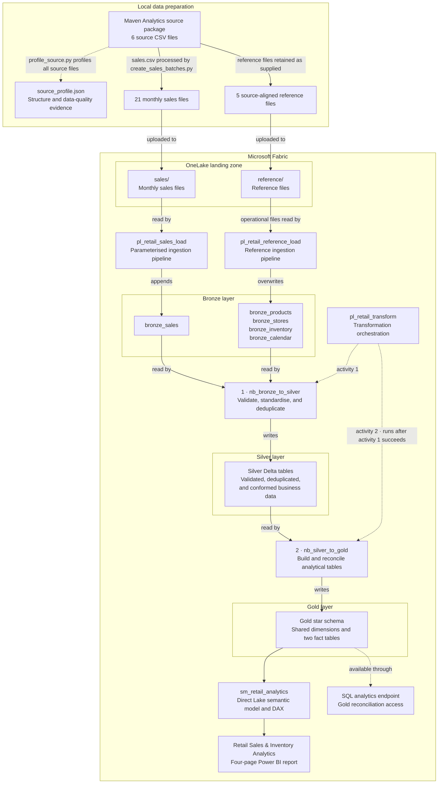

# Technical Architecture

This document expands the high-level architecture shown in the main README and describes the item-level data flow, orchestration boundaries, and key architectural design choices.

## Detailed End-to-End Flow

Solid arrows show the movement and transformation of data. Dashed arrows show supporting profiling, orchestration control, or validation access.

`pl_retail_transform` does not store or transform data directly. It runs `nb_bronze_to_silver` first and starts `nb_silver_to_gold` only after the first notebook activity succeeds. The notebooks read from and write to the Lakehouse layers shown by the solid data path.

The fifth reference file, `data_dictionary.csv`, remains in the landing zone as source documentation and is not loaded into a Bronze table.

## Architectural Design Choices

| Area | Design choice | Rationale |
|---|---|---|
| Local preparation | Source profiling and monthly sales-batch creation run before Fabric ingestion. | Establishes a reproducible source baseline and repeatable ingestion inputs. |
| Ingestion | Monthly sales files use parameter-driven append ingestion, while complete reference extracts overwrite their Bronze tables. | Aligns each ingestion strategy with the way its source data is delivered. |
| Medallion transformation | Bronze preserves source-aligned records and ingestion metadata. Silver validates, standardises, and deduplicates the data, while Gold deterministically rebuilds and reconciles the analytical model. | Separates traceability, data conformance, and analytical modelling into clear responsibilities. |
| Analytics | The Direct Lake semantic model queries the Gold tables and adds reusable DAX measures and disconnected report controls. | Supports flexible analysis without creating another imported copy of the analytical data. |

> [!NOTE]
> Inventory represents the latest supplied store-product position because the source does not contain historical snapshots.

## Related Documentation

- See the [main README](../README.md) for business outcomes, report pages, data modelling, and analytical definitions.
- See the [deployment guide](deployment.md) for import order, environment rebinding, and deployment validation.
- See [`validate_gold.sql`](../sql/validate_gold.sql) for independent Gold-layer reconciliation.
